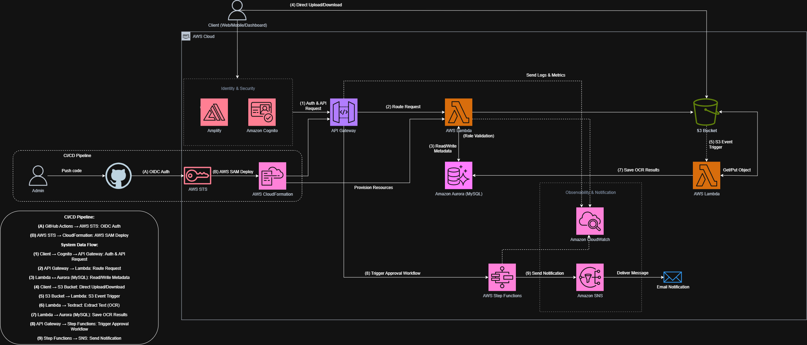

# Nền tảng Cộng tác Tài liệu Doanh nghiệp (EDMS)

## Quản lý tài liệu Serverless trên nền tảng AWS

### 1. Tổng quan Project

EDMS (Enterprise Document Management System) là một nền tảng cộng tác tài liệu cloud-native cho phép doanh nghiệp lưu trữ, quản lý phiên bản, chia sẻ và phê duyệt tài liệu qua một hệ thống web tập trung, an toàn. Hệ thống bao gồm các tính năng như phân quyền truy cập theo vai trò (ADMIN / MANAGER / USER), quản lý tài liệu và thư mục, quản lý phiên bản, chia sẻ với quyền kiểm soát, tags, search, và quy trình phê duyệt tự động kèm thông báo email. Vì hệ thống phải phục vụ nhiều người dùng ở các phòng ban trong khi giữ chi phí vận hành thấp, nó đòi hỏi một hạ tầng linh hoạt, có khả năng mở rộng, sẵn sàng cao và dễ bảo trì.

Proposal này trình bày giải pháp triển khai hệ thống EDMS trên nền tảng Amazon Web Services (AWS) bằng một kiến trúc hoàn toàn **serverless** đáp ứng các yêu cầu về khả năng mở rộng, tính sẵn sàng cao, bảo mật, và quy trình phát hành tự động. Mục tiêu là xây dựng một hạ tầng serverless tái sử dụng, hỗ trợ triển khai lặp lại và chuẩn hóa quy trình vận hành theo thực hành DevOps trong môi trường production.

Proposal tập trung xây dựng kiến trúc serverless AWS với **AWS Lambda** và **Amazon API Gateway** cho compute, **Amazon Aurora MySQL** cho cơ sở dữ liệu, **Amazon S3** cho lưu trữ file, **Amazon Cognito** cho xác thực, **AWS Step Functions** cho quy trình phê duyệt, **Amazon SNS** cho thông báo, và **AWS Amplify** cho hosting frontend. Mã nguồn được quản lý trên GitHub, với các workflow Build–Test–Deploy tự động qua GitHub Actions và OpenID Connect (OIDC), và hạ tầng được cung cấp bởi AWS SAM / CloudFormation. Giải pháp nhằm thiết lập một quy trình triển khai thống nhất, an toàn và có khả năng mở rộng cho project.

---

### 2. Phát biểu vấn đề

#### Hiện trạng

Trước khi triển khai proposal, quy trình quản lý tài liệu doanh nghiệp bị phân tán qua email, Google Drive cá nhân, và file server on-premise. Cụ thể:

- **Thiếu kiểm soát tập trung:** Không kiểm soát được ai truy cập tài liệu nào, và không có lịch sử audit các thao tác.
- **Không có quy trình phê duyệt:** Tài liệu có thể được công bố mà không qua cổng phê duyệt trước khi chính thức.
- **Chi phí hạ tầng cố định:** File server on-premise phát sinh chi phí cố định bất kể mức sử dụng thực tế.
- **Triển khai thủ công, không tự động:** Ứng dụng chưa được chuẩn hóa thành pipeline triển khai cloud-native, tự động.

#### Mục tiêu

Proposal nhằm đạt các mục tiêu kỹ thuật sau:

- Cung cấp kiểm soát truy cập tập trung theo vai trò cho tài liệu.
- Tự động hóa quy trình phê duyệt tài liệu (submit → approve/reject → notify).
- Loại bỏ việc dùng AWS Access Keys trong GitHub qua OpenID Connect (OIDC).
- Chuẩn hóa quy trình triển khai bằng infrastructure as code (AWS SAM).
- Đảm bảo tính sẵn sàng cao và khả năng mở rộng tự động của hệ thống.
- Thiết lập cơ chế giám sát, logging và cảnh báo tập trung.
- Tuân theo mô hình DevOps và nâng cao khả năng tái sử dụng.

#### Giải pháp

- Thiết kế kiến trúc serverless AWS.
- Xây dựng CI/CD pipeline với GitHub Actions + SAM.
- Triển khai backend Spring Boot thành một Lambda phía sau API Gateway.
- Lưu tài liệu trong Amazon S3 và metadata trong Aurora MySQL.
- Cung cấp xác thực và phân quyền theo vai trò với Amazon Cognito.
- Điều phối phê duyệt với AWS Step Functions và gửi email qua SNS.
- Host frontend React trên AWS Amplify.
- Xây dựng hệ thống logging và giám sát với CloudWatch.

#### Hoàn vốn (ROI)

Chuẩn hóa và tự động hóa hệ thống mang lại giá trị thực tế:

- **Hiệu quả chi phí:** Mô hình serverless đảm bảo chỉ trả tiền cho tài nguyên thực sự dùng, chi phí idle gần bằng không.
- **Thời gian phát hành:** CI/CD pipeline tự động giảm thời gian phát hành tính năng mới.
- **Tính sẵn sàng cao:** Các dịch vụ được quản lý, tự động scale đạt uptime cao và giảm thời gian chết.
- **Bảo mật và kiểm soát tốt hơn:** Tiêu chuẩn bảo mật AWS kết hợp phân quyền theo vai trò và giám sát bảo vệ dữ liệu, phát hiện lỗ hổng chủ động.

---

### 3. Kiến trúc giải pháp

#### Kiến trúc tổng thể

Kiến trúc triển khai hoàn toàn serverless:

- **Frontend hosting:** React SPA được host trên AWS Amplify và phục vụ qua HTTPS.
- **Xử lý API:** Amplify chuyển request đến Amazon API Gateway, nơi route chúng đến một AWS Lambda duy nhất chạy backend Spring Boot.
- **Xác thực:** Amazon Cognito phát hành JWT token và cung cấp phân quyền theo vai trò (ADMIN / MANAGER / USER).
- **Cơ sở dữ liệu:** Amazon Aurora MySQL lưu toàn bộ metadata quan hệ (users, documents, versions, folders, permissions, tags, shares, approval history).
- **Lưu trữ:** Amazon S3 lưu các file tài liệu gốc, truy cập riêng tư qua pre-signed URLs.
- **Quy trình phê duyệt:** AWS Step Functions điều phối luồng phê duyệt dùng mẫu Wait for Task Token; Amazon SNS gửi thông báo email.
- **CI/CD:** Mã nguồn được push lên GitHub. GitHub Actions dùng OIDC để xác thực với AWS STS và chạy `sam deploy`.
- **Bảo mật và hạ tầng:** AWS IAM quản lý quyền truy cập; AWS SAM / CloudFormation chuẩn hóa việc cung cấp hạ tầng.
- **Giám sát hệ thống:** Amazon CloudWatch thu thập log và metric.

#### Các thành phần kiến trúc

| AWS Service | Loại dịch vụ | Vai trò trong hệ thống |
| ----------- | ------------ | ---------------------- |
| **AWS IAM** | Identity & Access Management | Quản lý users, groups, roles, và security policies; dùng cho role thực thi Lambda và OIDC deploy role. |
| **AWS Lambda** | Serverless Compute | Chạy backend monolith Spring Boot (Java 17). |
| **Amazon API Gateway** | API Gateway | Phơi backend thành REST API và route request đến Lambda. |
| **Amazon Cognito** | Xác thực | Cung cấp đăng nhập và phân quyền theo vai trò qua JWT. |
| **Amazon Aurora** | Cơ sở dữ liệu quan hệ | Lưu metadata quan hệ (tương thích MySQL). |
| **Amazon S3** | Object Storage | Lưu các file tài liệu gốc, truy cập qua pre-signed URLs. |
| **AWS Step Functions** | Điều phối Workflow | Điều phối quy trình phê duyệt tài liệu (waitForTaskToken). |
| **Amazon SNS** | Dịch vụ thông báo | Gửi email khi duyệt/từ chối. |
| **AWS Amplify** | Frontend Hosting | Host frontend React qua HTTPS. |
| **Amazon CloudWatch** | Giám sát & Observability | Thu thập log và metric, cấu hình dashboards và alarms. |

#### AWS Well-Architected Framework

| Trụ cột | Giải pháp áp dụng |
| ------- | ----------------- |
| Operational Excellence | GitHub Actions CI/CD, AWS SAM / CloudFormation, CloudWatch. |
| Security | IAM Least Privilege, xác thực Cognito, S3 bucket private, không dùng AWS keys trong GitHub (OIDC). |
| Reliability | Các dịch vụ được quản lý serverless, Step Functions retries, giám sát CloudWatch. |
| Performance Efficiency | Auto scaling Lambda + API Gateway, S3 + pre-signed URLs. |
| Cost Optimization | Serverless pay-as-you-go, stop/xóa Aurora khi idle. |
| Sustainability | Scale theo nhu cầu; chỉ trả tiền cho mức sử dụng thực tế. |

---

### 4. Lộ trình & Mốc

| Giai đoạn | Thời gian | Nhiệm vụ chính |
| --------- | --------- | -------------- |
| **Tuần 1: Nghiên cứu & Thiết kế** | 22/06/2026 - 26/06/2026 | - Tìm hiểu AWS Foundations (Global Infrastructure, IAM, EC2, S3).   - Thiết kế kiến trúc hệ thống và luồng dữ liệu. |
| **Tuần 2: Lưu trữ & Bảo mật** | 29/06/2026 - 03/07/2026 | - Học Amazon S3, IAM, và Git.   - Thực hành S3 + IAM + Git. |
| **Tuần 3: Cơ sở dữ liệu & Thiết kế** | 06/07/2026 - 10/07/2026 | - Học Aurora MySQL và thiết kế mô hình dữ liệu EDMS.   - Tạo S3, Aurora, IAM, Cognito. |
| **Tuần 4: Phát triển Backend** | 13/07/2026 - 17/07/2026 | - Thiết lập backend Spring Boot.   - Triển khai xác thực Cognito + JWT.   - Triển khai CRUD tài liệu và thư mục. |
| **Tuần 5: Backend nâng cao** | 20/07/2026 - 24/07/2026 | - Triển khai permissions, versioning, tags, search, sharing, dashboard.   - Viết unit tests. |
| **Tuần 6: Quy trình phê duyệt** | 27/07/2026 - 31/07/2026 | - Học Step Functions (waitForTaskToken).   - Tạo SNS topic.   - Xây dựng state machine phê duyệt. |
| **Tuần 7: CI/CD & Deploy** | 03/08/2026 - 07/08/2026 | - Đóng gói backend thành Lambda (SAM).   - Cấu hình OIDC + GitHub secrets.   - Viết GitHub Actions workflow và deploy. |
| **Tuần 8: Hosting & Go-Live** | 10/08/2026 - 15/08/2026 | - Host frontend trên Amplify.   - Chạy kiểm thử end-to-end.   - Hoàn thiện báo cáo và demo. |

---

### 5. Ước tính ngân sách

Hệ thống tận dụng tối đa **AWS Free Tier** và mô hình **Serverless Pay-As-You-Go**, chỉ trả tiền cho tài nguyên thực sự dùng.

| AWS Service | Mức sử dụng ước tính / Giai đoạn | Chi phí ước tính (USD) |
| ----------- | ------------------------------- | ---------------------- |
| **AWS Lambda** | Backend monolith Spring Boot, gọi qua API Gateway | **~$0 - $5** |
| **Amazon API Gateway** | Các request REST API | **~$0 - $1** |
| **Amazon Aurora MySQL** | Cơ sở dữ liệu metadata quan hệ | **~$5 - $15** (nguồn chi phí chính) |
| **Amazon S3** | Lưu trữ tài liệu + pre-signed URLs | **~$1 - $3** |
| **Amazon Cognito** | User pool (free tier) | **~$0** |
| **AWS Step Functions** | Các execution quy trình phê duyệt | **~$0 - $2** |
| **Amazon SNS** | Thông báo email (free tier) | **~$0** |
| **AWS Amplify** | Frontend hosting | **~$1 - $3** |
| **Amazon CloudWatch** | Log và metric | **~$1 - $3** |
| **Tổng ước tính mỗi tháng** | | **~$8 - $30** |

Ngoài ra, proposal còn áp dụng các biện pháp tối ưu chi phí:

- Cấu hình **AWS Budgets** và cảnh báo SNS ở 50%, 80% và 100% ngân sách tháng.
- Stop hoặc xóa **Aurora** khi không sử dụng (nguồn chi phí chính).
- Dùng AWS Free Tier khi có thể.
- Xóa hoặc stop các tài nguyên không dùng trong môi trường staging sau khi test.

---

### 6. Đánh giá rủi ro

#### Ma trận rủi ro

| Rủi ro | Khả năng | Tác động |
| ------ | -------- | -------- |
| Chi phí AWS vượt dự kiến (chủ yếu Aurora) | Trung bình | Trung bình |
| Lambda cold start latency | Trung bình | Thấp |
| Lỗi quy trình phê duyệt | Thấp | Trung bình |
| Lộ thông tin nhạy cảm | Thấp | Rất cao |
| Lưu lượng tăng đột biến | Trung bình | Thấp |
| Thiếu log hoặc cảnh báo | Trung bình | Trung bình |
| Lỗi khi triển khai phiên bản mới | Trung bình | Trung bình |

#### Kế hoạch ứng phó

- Xử lý ngay các cảnh báo chi phí khi đạt ngưỡng ngân sách; stop hoặc xóa Aurora khi không dùng.
- Khi có lỗi API, kiểm tra CloudWatch Logs và Step Functions executions trước khi rollback hoặc deploy bản sửa.
- Khi phát hiện dấu hiệu lộ credentials, thu hồi hoặc xoay secret, rà soát IAM permissions, và audit lịch sử triển khai.
- Dùng Step Functions retries và CloudWatch alarms để xử lý lỗi workflow và vấn đề lưu lượng.

---

### 7. Kết quả mong đợi

Sau khi hoàn thành quy trình triển khai, hệ thống được kỳ vọng đạt các kết quả sau:

- **Cải thiện kỹ thuật:** Thay thế việc xử lý tài liệu thủ công và lưu trữ phân tán bằng một nền tảng tài liệu serverless tập trung, an toàn, có thể giám sát, mở rộng và tự động triển khai trên AWS, bao gồm quy trình phê duyệt tự động.
- **Giá trị dài hạn:** Thiết lập kiến trúc serverless tái sử dụng và infrastructure as code, làm nền tảng cho việc mở rộng các tính năng như phân tích nâng cao, OCR, và tích hợp với các hệ thống doanh nghiệp khác trong tương lai.

---

### 8. Tài liệu tham khảo

[1]: [AWS Well-Architected Framework](https://aws.amazon.com/architecture/well-architected/)
[2]: [The First Cloud Journey](https://cloudjourney.awsstudygroup.com/)
[3]: [AWS Documentation](https://docs.aws.amazon.com/)
