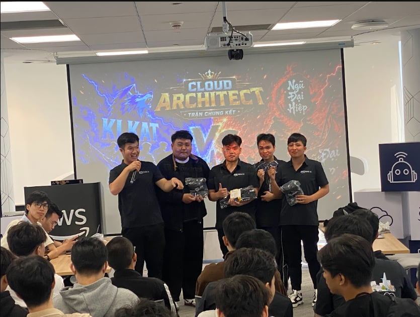
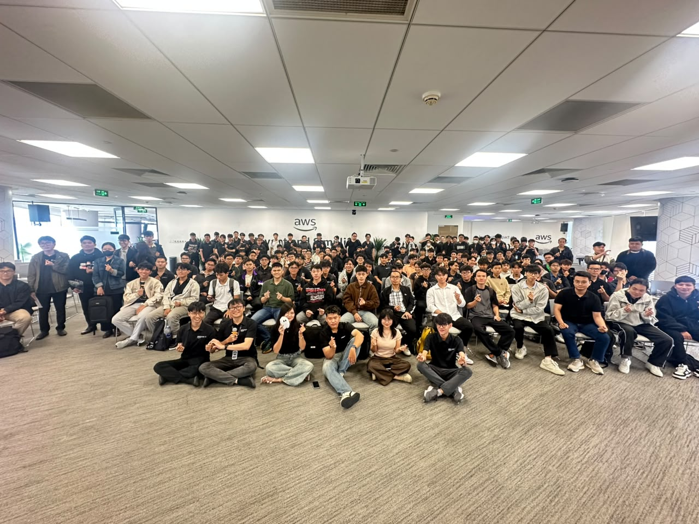

# Bài Thu Hoạch Sự Kiện “Cloud Architect”

## Mục Đích Của Sự Kiện

- Tổng kết và trao giải cho cuộc thi thiết kế kiến trúc hệ thống, tạo sân chơi thực chiến dưới áp lực cao để các lập trình viên, sinh viên và chuyên gia cùng nhau thể hiện tư duy thiết kế hạ tầng công nghệ.
- Nâng cao kiến thức chuyên sâu về các tiêu chuẩn kỹ thuật quan trọng trong vận hành hệ thống đám mây như SLA (Thỏa thuận mức độ dịch vụ) và các công cụ giám sát (Monitoring).
- Truyền cảm hứng và định hướng lộ trình phát triển chuyên môn, giúp người tham gia cọ xát thực tế và làm quen với các tiêu chuẩn quốc tế như chứng chỉ AWS Certified Cloud Practitioner.
- Tạo không gian giao lưu, kết nối trực tiếp giữa cộng đồng công nghệ, sinh viên và các chuyên gia hàng đầu trong lĩnh vực điện toán đám mây.

## Danh Sách Các Đội Thi

- **Đội KLKAT**
- **Đội Ngũ Đại Hiệp** 

## Nội Dung Nổi Bật

### 1. Trận Chung Kết & Chiến Lược Kiến Trúc Từ Các Đội Thi

- **Không gian cạnh tranh đỉnh cao:** Sự kiện diễn ra tại Tòa nhà Tài chính Bitexco (BITEXCO Financial Tower) với bầu không khí chuyên nghiệp, căng thẳng và đầy tính sáng tạo.
- **Thực chiến thiết kế hệ thống:** Các đội thi phải bảo vệ mô hình kiến trúc của mình trước hội đồng giám khảo, giải quyết các bài toán về tối ưu hóa tài nguyên, tính sẵn sàng và chi phí vận hành trên nền tảng AWS.

### 2. SLA & Giám Sát Hệ Thống (Monitoring) trong Vận Hành Cloud

- **Bản chất của SLA và Độ sẵn sàng cao:** Tìm hiểu cam kết mức độ hoạt động (uptime) và độ sẵn sàng của các dịch vụ đám mây từ nhà cung cấp.
- **Thiết kế High Availability:** Phương pháp phân bổ tài nguyên trên nhiều Availability Zones (AZs) và áp dụng các mô hình dự phòng để loại bỏ điểm lỗi đơn (Single Point of Failure).
- **Vai trò của Monitoring:** Cách thức thu thập số liệu hiệu năng (Metrics) và phân tích nhật ký (Logs) để đo lường mức độ tuân thủ SLA và phát hiện sớm bất thường.
- **Tối ưu vận hành (MTTR):** Kết hợp cam kết kỹ thuật và công cụ giám sát tập trung giúp rút ngắn thời gian xử lý sự cố và duy trì ổn định hệ thống.

### 3. Định Hướng Phát Triển Với Chứng Chỉ AWS Certified Cloud Practitioner

- **Nền tảng kiến thức cốt lõi:** Tổng hợp các khái niệm cơ bản về điện toán đám mây, mô hình dịch vụ, bảo mật chung (Shared Responsibility Model) và kinh tế học đám mây.
- **Bước đệm sự nghiệp:** Định hướng lộ trình học tập và chinh phục các chứng chỉ quốc tế cho kỹ sư trẻ muốn bước chân vào lĩnh vực Cloud Architecture.

## Những Gì Học Được

### Về Tư Duy Thiết Kế & Chiến Lược

- **Tư duy xây dựng hệ thống bền vững:** Hiểu rõ cách thiết kế một kiến trúc đám mây không chỉ chạy được mà còn phải chịu lỗi tốt (Fault Tolerance) và có khả năng phục hồi nhanh (Resilience).
- **Quản trị rủi ro vận hành:** Nắm bắt tầm quan trọng của việc thiết lập các chỉ số đo lường chất lượng dịch vụ (SLA) và hệ thống cảnh báo tự động.

### Về Kiến Trúc Kỹ Thuật

- Nắm vững phương pháp phân bổ hạ tầng đa vùng (Multi-AZ) để đạt độ sẵn sàng cao nhất.
- Hiểu cách vận hành các công cụ giám sát tập trung để kiểm soát hiệu năng hệ thống phân tán.
- Nền tảng tư duy chuẩn hóa theo các tài liệu kiến trúc tham chiếu của AWS.

## Ứng Dụng Vào Công Việc / Đồ Án Thực Tập

- **Áp dụng vào Đồ án tốt nghiệp:** Tích hợp tư duy thiết kế hệ thống chịu lỗi và phân bổ tài nguyên hợp lý khi xây dựng các ứng dụng web quy mô lớn.
- **Xây dựng hệ thống giám sát cho Project:** Tự thiết lập các cơ chế theo dõi log và metrics cơ bản cho các dự án thực tập cá nhân để dễ dàng debug khi gặp lỗi.
- **Chuẩn bị hành trang nghề nghiệp:** Định hướng ôn tập và thi lấy chứng chỉ AWS Cloud Practitioner nhằm tạo lợi thế cạnh tranh khi ứng tuyển các vị trí Cloud/DevOps Intern tại doanh nghiệp.

## Trải Nghiệm Cá Nhân Trong Event

Tham gia sự kiện "Cloud Architect - Trận Chung Kết" là một trải nghiệm học hỏi vô cùng giá trị và thiết thực. Được trực tiếp chứng kiến màn so tài căng thẳng, tư duy xử lý vấn đề sắc bén của các đội thi tại không gian hiện đại của Bitexco đã mang lại cho em góc nhìn thực tế về cách một hệ thống lớn được xây dựng và vận hành. Các phần chia sẻ chuyên sâu về SLA và Monitoring từ các chuyên gia giúp em hệ thống hóa lại kiến thức nền tảng, đồng thời tiếp thêm động lực lớn để em tiếp tục nỗ lực hoàn thiện kỹ năng chuyên môn trên con đường trở thành kỹ sư Cloud/DevOps trong tương lai.

#### Một số hình ảnh khi tham gia sự kiện

> Tổng thể, sự kiện không chỉ cung cấp kiến thức kỹ thuật mà còn giúp tôi thay đổi cách tư duy về thiết kế ứng dụng, hiện đại hóa hệ thống và phối hợp hiệu quả hơn giữa các team.