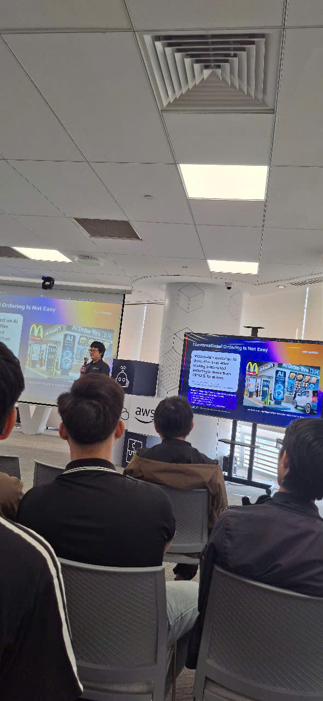
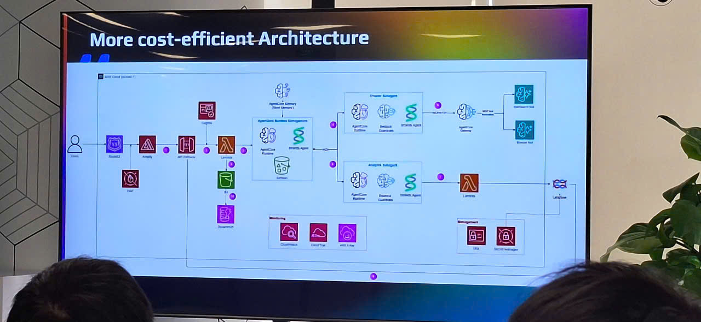

# Bài thu hoạch “FCAJ x Agentic AI Build Week: Show Up. Build. Pitch. WIN!”

### Mục Đích Của Sự Kiện

- Tổng kết và trao giải cho cuộc thi Hackathon "Agentic AI Build Week".
- Tạo sân chơi thực chiến (hands-on) dưới áp lực cao để các lập trình viên, sinh viên và chuyên gia cùng nhau lên ý tưởng, xây dựng kiến trúc và demo các sản phẩm công nghệ ứng dụng Agentic AI.
- Truyền cảm hứng và định hướng tư duy làm sản phẩm trong kỷ nguyên trí tuệ nhân tạo thông qua những lời khuyên từ các diễn giả.
- Tạo cơ hội để các đội thi trình bày (Pitching) trực tiếp giải pháp của mình trước hội đồng giám khảo chuyên môn, chứng minh tính khả thi của công nghệ trong việc giải quyết các nỗi đau (pain points) thực tế của doanh nghiệp.

### Danh Sách Diễn Giả

- **Giuseppe Marazzotta** - Head of Tech & Solution Architecture, ASEAN
- **One Team (Giải Nhất)** - Dự án AI Chatbot đặt hàng thức ăn tự động.
- **Signal Scout (Giải Nhì - Nhóm sinh viên FPT)** - Dự án Multi-Agent phân tích chiến lược đối thủ.
- **Team Plan** - Dự án Trợ lý Ảo AI hỗ trợ thiết kế hạ tầng Cloud.
- **Team 3K** - Dự án AI Computer Vision theo dõi đám đông (Sheper).
- **Team Six Pillars** - Dự án AI Workflow phòng chống rửa tiền (AML) cho Ngân hàng.
### Nội Dung Nổi Bật

#### Tầm nhìn Công nghệ từ Lãnh đạo AWS

- Sự dịch chuyển của tốc độ phát hành (Release): Nếu như 20 năm trước các hệ thống ngân hàng cần 1 quý để release sản phẩm, thì trong kỷ nguyên của AI Agents, việc release có thể diễn ra theo từng phút.
- Lợi thế của thế hệ trẻ: Lập trình viên trẻ không bị cản bước bởi các "nợ công nghệ" cũ. AI và phần cứng (như các đội robot tự động của Amazon) chỉ là công cụ vô tri nếu thiếu đi "Human-in-the-loop" – những kỹ sư trẻ biết định hướng, đánh giá và cấp quyền cho AI hoạt động.

#### Các Giải Pháp AI Đột Phá Từ Các Đội Thi

- **Hệ thống Đặt thức ăn qua Zalo bằng AI Agent (One Team)**: Giải quyết rào cản "phải tải App" khi đặt hàng. Khách hàng chỉ cần chat tự nhiên trên Zalo/WhatsApp, AI (AWS Bedrock Agent Core) sẽ tự động Scraping menu, ghi nhớ lịch sử đặt hàng, xử lý giỏ hàng và áp dụng khuyến mãi. Tối ưu chi phí hạ tầng xuống mức cực thấp (~0.006 USD/đơn hàng).
- **Multi-Agent Phân tích Doanh nghiệp (Signal Scout)**: Hệ thống cào dữ liệu (Crawler) sử dụng Tiny Fish và AWS Amplify để vượt qua các tường đăng nhập (Login Wall). Hệ thống tự động thu thập dữ liệu rải rác về cơ cấu, tài chính của công ty đối thủ, sau đó chấm điểm bằng Langfuse và đưa ra báo cáo tư vấn chiến lược.
- **Trợ lý Thiết kế Kiến trúc Cloud (Team Plan)**: Giúp các Solutions Architect (SA) tự động hóa việc vẽ sơ đồ kiến trúc. Từ yêu cầu bằng văn bản (Natural Language) hoặc tài liệu, AI sẽ vẽ kiến trúc lên Draw.io, tính toán bảng giá và sinh ra mã cơ sở hạ tầng (IaC - Terraform) chuẩn hóa theo policy của công ty.
- **Camera AI theo dõi đám đông (Team 3K)**: Ứng dụng Yolo v26 kết hợp ByteTrack để nhận diện và theo dõi dòng người theo thời gian thực (Real-time). Dữ liệu video đẩy qua Kinesis Video Streams và phân tích bằng AI để tính toán mật độ, thời gian chờ, từ đó tự động điều phối nhân viên đến các khu vực đang ùn tắc tại siêu thị, sân bay.
- **Hệ thống Phòng chống Rửa tiền - AML (Six Pillars)**: Giải quyết tình trạng 90-95% cảnh báo giao dịch giả (False Positive) tại ngân hàng. Kết hợp Machine Learning XGBoost để phân loại nhanh giao dịch và 3 AI Sub-agents (KYC Check, Money Flow Check, Sanction Check) để tự động hóa khâu điều tra hồ sơ. Kết quả xuất ra một file Bằng chứng (Evidence File) để con người đưa ra quyết định cuối cùng.

### Những Gì Học Được

#### Về Tư Duy Sản Phẩm & Khởi nghiệp (Startup Mindset)
- **Bắt đầu từ "Nỗi đau" (Pain Point)**: Công nghệ phức tạp đến đâu cũng vô nghĩa nếu không giải quyết được vấn đề thực tiễn. Đừng chỉ tập trung vào framework/code mà phải biết trả lời câu hỏi: "Sản phẩm này dùng cho ai và giải quyết bài toán gì?".

- **Giới hạn phạm vi (Scope Down) cho MVP**: Trong các dự án thời gian ngắn, việc kiểm soát scope là yếu tố sống còn. Đừng làm một hệ thống khổng lồ nhưng lỗi, hãy tập trung vào một kịch bản cốt lõi (MVP) có thể demo trơn tru từ đầu đến cuối.

#### Về Kỹ Năng Mềm & Làm Việc Nhóm
**Sức mạnh của Teamwork dưới áp lực cao:** Làm việc liên tục trong 24 giờ đòi hỏi các thành viên phải dẹp bỏ "cái tôi", phân chia rõ ràng vai trò (Front-end, Back-end, Pitching, UI/UX) và hoàn toàn tin tưởng vào quyết định của nhau.

**Kỹ năng Pitching (Trình bày):** Việc trình bày dự án không chỉ xoay quanh kiến trúc công nghệ mà phải làm nổi bật được Mô hình kinh doanh, Chi phí vận hành và Tính bảo mật.

#### Về Kiến Trúc Cloud & AI
- Hiểu cách kết hợp giữa luồng logic truyền thống (Rule-based) và trí tuệ nhân tạo (LLM/Agents) để giảm thiểu hiện tượng "ảo giác" (Hallucination) của AI.

- Thay vì tự build mọi thứ, việc ứng dụng các Cloud Managed Services (Kinesis, DynamoDB, Bedrock, Cognito) giúp tăng tốc độ phát triển dự án lên gấp nhiều lần.

### Ứng Dụng Vào Công Việc / Đồ Án Thực Tập

- **Áp dụng chiến lược MVP vào Projects**: Không tham vọng nhồi nhét quá nhiều tính năng. Tập trung xây dựng luồng nghiệp vụ chính chạy ổn định, có Demo trực quan trước khi nghiên cứu các công nghệ phụ trợ.

- **Mô hình hóa dữ liệu và Tích hợp LLM**: Áp dụng phương pháp của nhóm Six Pillars vào các đồ án ứng dụng AI — dùng AI để tạo "Bằng chứng/Báo cáo tổng hợp" (Evidence File) hỗ trợ người dùng ra quyết định, thay vì để AI tự động thực thi các tác vụ nhạy cảm liên quan đến database.

- **Tự động hóa Infrastructure (IaC)**: Lấy cảm hứng từ Team Plan, nghiên cứu thêm về Terraform và AWS CloudFormation để tự động hóa việc triển khai hạ tầng cho các dự án thực tập thay vì setup thủ công bằng tay, giúp tiết kiệm thời gian và dễ dàng rollback.

- **Rèn luyện kĩ năng trình bày (Pitching)**: Chuẩn bị sẵn các kịch bản đối đáp liên quan đến tính ứng dụng, bảo mật và chi phí (Cost) của hệ thống — những câu hỏi kinh điển mà các hội đồng chấm đồ án/nhà tuyển dụng thường xuyên đặt ra.

### Trải nghiệm trong event

- Theo dõi sự kiện tổng kết **Agentic AI Build Week** mang lại cho tôi sự nể phục lớn đối với các builder trẻ. Những trải nghiệm đáng nhớ cùng nhau như: thức tới 4h sáng, cãi nhau nảy lửa vì bất đồng ý tưởng kiến trúc, push nhầm file .env lên GitHub hay camera bị lỗi mạng ngay lúc demo... đều là những trải nghiệm thực chiến quý giá mà sách vở không thể dạy.

- Điều truyền cảm hứng nhất là tinh thần **Show Up. Build. Pitch** — cứ dấn thân, đăng ký đi rồi tính tiếp. Mọi nỗi sợ về việc "trình độ chưa đủ" đều bị xóa nhòa khi bạn được đưa vào một môi trường buộc phải tư duy và bứt phá giới hạn. Thông qua các phần trình bày, tôi không chỉ nạp thêm được vô số kiến thức mới về cách thiết kế Multi-Agent hay xử lý Real-time Video Stream, mà còn tự hứa với bản thân sẽ bước ra khỏi vùng an toàn, tham gia ít nhất một giải Hackathon trong thời gian tới để cọ xát và mở rộng network của chính mình.

#### Một số hình ảnh khi tham gia sự kiện

> Tổng thể, sự kiện không chỉ cung cấp kiến thức kỹ thuật mà còn giúp tôi thay đổi cách tư duy về thiết kế ứng dụng, hiện đại hóa hệ thống và phối hợp hiệu quả hơn giữa các team.