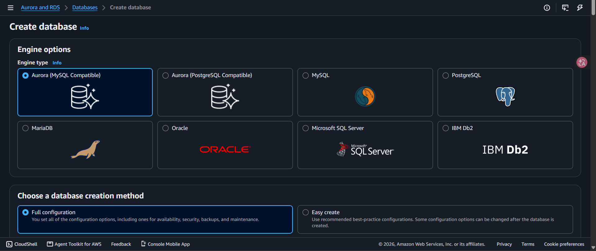
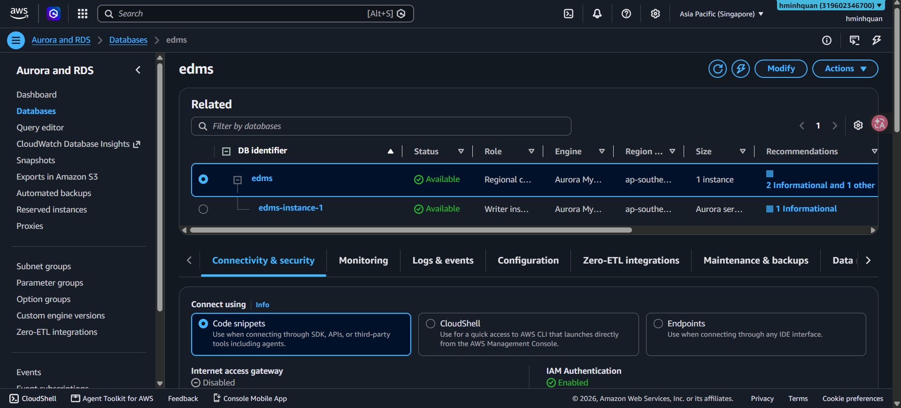
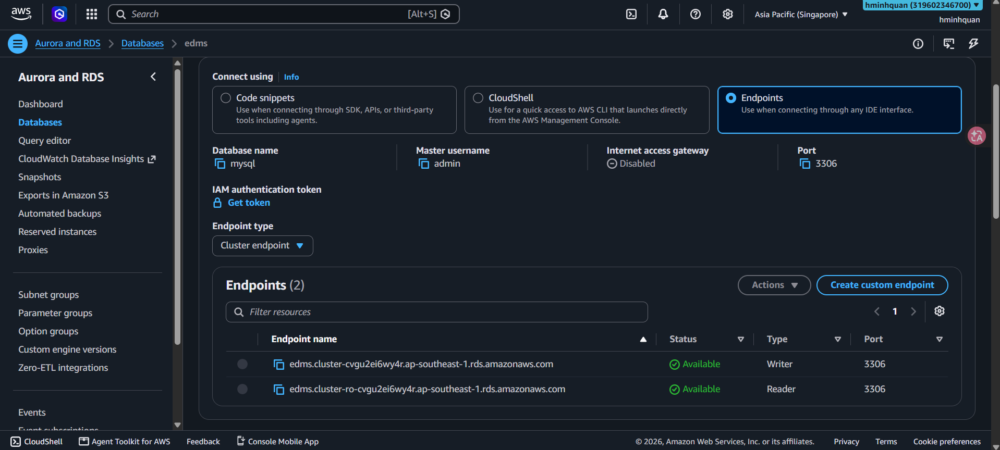

EDMS dùng **Amazon Aurora (MySQL)** để lưu toàn bộ metadata quan hệ (người dùng, thư mục, tài liệu, bình luận, lịch sử phiên bản). Trong phần này bạn tạo Aurora cluster, đợi nó khả dụng, tạo database `edms` ban đầu và ghi lại endpoint để cấu hình sau.

### 5.3.2.1 Mở RDS console

1. Trong AWS console, đảm bảo region là **ap-southeast-1**.
2. Mở **Amazon RDS console**.
3. Trong menu bên trái, bấm **Databases** để xem danh sách cluster (hiện đang trống).

### 5.3.2.2 Tạo Aurora MySQL cluster

1. Bấm **Create database**.



2. Trong trang **Create database**, cấu hình:

**Engine options**
+ **Engine type:** chọn **Aurora (MySQL Compatible)**.

**Database creation method**
+ Chọn **Standard create** (Full configuration) để tự kiểm soát mọi tùy chọn.

**Templates**
+ Chọn một template. Để tiết kiệm chi phí, chọn **Dev/Test** (khuyến nghị cho workshop). **Production** bật các mặc định high-availability và đắt hơn.

**Cluster scalability type**
+ **Aurora Serverless v2** (khuyến nghị — tự co giãn theo mức sử dụng, phù hợp workshop) hoặc **Provisioned** (công suất cố định).
+ Nếu chọn **Provisioned**, trong **Instance configuration** chọn lớp **Burstable** (dòng `db.t`, ví dụ `db.t3.medium` hoặc `db.r7g.large`) — rẻ hơn memory-optimized (dòng `db.r`).

**Settings**
+ **DB cluster identifier:** `edms`.
+ **Engine version:** giữ mặc định **Aurora MySQL 3.x** (tương thích MySQL 8.x).

**Credentials Settings**
+ **Master username:** `admin`.
+ **Credentials management:** chọn **Self managed** và đặt **Master password** mạnh. Lưu mật khẩu ở nơi an toàn (backend sẽ cần).

**Cluster storage configuration**
+ **Aurora Standard** (trả phí theo I/O) thường đủ và rẻ hơn cho workshop. **Aurora I/O-Optimized** cho giá dự đoán được nếu workload nặng về I/O.

**Availability & durability**
+ **Don't create an Aurora Replica** (một instance là đủ cho workshop).

**Connectivity**
+ **Compute resource:** **Don't connect to an EC2 compute resource**.
+ **Network type:** **IPv4**.
+ **VPC:** giữ **Default VPC** (hoặc VPC của project).
+ **Public access:** **No** (backend chạy trong Lambda/VPC).
+ **VPC security group:** giữ security group **default**.
+ Để **RDS Data API** tắt (backend dùng JDBC).

**Additional configuration (mở rộng)**
+ **Tags (tùy chọn):** thêm tag như `Project=EDMS`.
+ **Monitoring:** bật **Database Insights – Standard** (miễn phí) và tùy chọn **Enhanced Monitoring**.
+ **Log exports:** tùy chọn chọn **Error log** và **Slow query log**.
+ **Delete protection:** để **bật** trong lúc phát triển; nhớ tắt trước khi xóa cluster ở phần dọn dẹp (5.5.7).

3. Xem lại **Estimated monthly costs** (phụ thuộc nhiều vào instance class và storage), rồi bấm **Create database**.

> **Ghi chú:** Aurora dùng mô hình **cluster** có thể chứa một hoặc nhiều instance. Một instance là đủ cho workshop này; sau này bạn có thể thêm read replica nếu cần tăng hiệu năng đọc.

### 5.3.2.3 Đợi khả dụng

Cluster mất vài phút để provision.

1. Quay lại danh sách **Databases**.
2. Tìm `edms` và theo dõi cột **Status**.
3. Đợi trạng thái đổi từ *Creating* sang **Available**.
4. (Tùy chọn) Bấm vào tên cluster để xem writer endpoint và reader endpoint.



> **Ghi chú:** Đừng tiếp tục cho đến khi cluster hiển thị **Available** — endpoint chưa dùng được trước lúc đó.

### 5.3.2.4 Tạo database ban đầu

Amazon Aurora tạo sẵn một database mặc định. Ứng dụng cần một database riêng tên `edms`.

1. Mở **Query Editor v2** (trong RDS console) hoặc kết nối bằng MySQL client.
2. Chạy SQL sau để tạo database ứng dụng dùng:

```sql
CREATE DATABASE IF NOT EXISTS edms
  CHARACTER SET utf8mb4
  COLLATE utf8mb4_unicode_ci;
```

3. Xác minh database đã tồn tại:

```sql
SHOW DATABASES;
```

> **Ghi chú:** Backend tự động áp dụng schema bằng **Flyway** migrations từ `backend/src/main/resources/db/migration`, nên bạn chỉ cần tạo database rỗng ở đây.

### 5.3.2.5 Lấy endpoint

1. Trong danh sách **Databases**, bấm `edms`.
2. Mở tab **Connectivity & security**.
3. Sao chép giá trị **Endpoint** (hostname) — ví dụ `edms.cluster-xxxx.ap-southeast-1.rds.amazonaws.com`.



4. Lưu endpoint, user và mật khẩu database vào cấu hình `.env` / SAM của project:

```
AURORA_ENDPOINT=<endpoint>
DB_USER_AWS=admin
DB_PASS_AWS=<mat-khau>
DB_NAME=edms
```

> **Ghi chú chi phí:** Aurora tính phí ngay cả khi không sử dụng. Hãy stop hoặc xóa cluster khi hoàn thành workshop (xem 5.5.7) để tránh phát sinh chi phí kéo dài.
