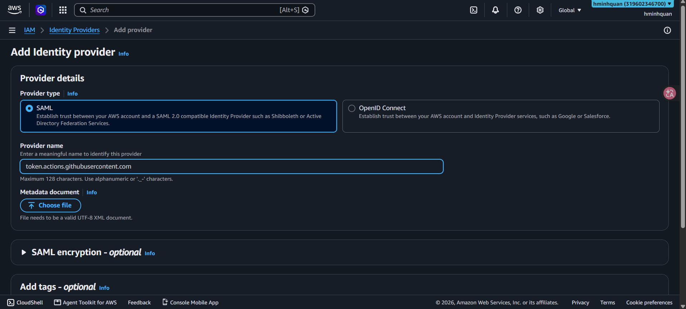

IAM cung cấp các định danh và quyền cần thiết để EDMS hoạt động an toàn. Cần hai role:

1. **`github-actions-deploy-role`** — role **OIDC** (Web identity) mà GitHub Actions assume khi deploy, để **không** phải lưu AWS key dài hạn trong repository.
2. **`edms-lambda-role`** — role thực thi cho các hàm Lambda (S3, Cognito, SNS, Step Functions, CloudWatch Logs).

### 5.3.3.1 Tạo OIDC provider

Để GitHub Actions assume một role (thay vì giữ AWS key vĩnh viễn), hãy đăng ký OIDC provider của GitHub với IAM:

1. Mở **IAM console** → **Identity providers** → **Add provider**.

2. Trong trang **Add identity provider**:

**Provider type**
+ Chọn **OpenID Connect** (thiết lập trust giữa tài khoản AWS của bạn và một identity provider như GitHub). **Không** chọn SAML.

**Provider details**
+ **Provider name:** nhập `token.actions.githubusercontent.com` (URL issuer OIDC của GitHub). Phải khớp chính xác.
+ **Audience:** nhập `sts.amazonaws.com`.
+ **Thumbprint** được AWS tự lấy khi bạn thêm provider — không cần dán thủ công.

3. (Tùy chọn) Trong **Add tags**, bạn có thể thêm tag như `Project=EDMS`.
4. Bấm **Add provider**.

> **Ghi chú:** Bước này chỉ thực hiện một lần cho mỗi tài khoản AWS. Provider URL phải khớp chính xác `https://token.actions.githubusercontent.com`.

### 5.3.3.2 Tạo deploy role cho GitHub Actions

Mở **IAM** → **Roles** → **Create role**. Wizard có 3 bước:

#### Bước 1: Select trusted entity

+ **Trusted entity type:** chọn **Web identity** — *"Allows users federated by the specified external web identity provider to assume this role to perform actions in this account."*

**Cấu hình Web identity**

+ **Identity provider:** chọn `token.actions.githubusercontent.com` (OIDC provider GitHub đã tạo ở 5.3.3.1). Nếu chưa có, bấm **Create new** để đăng ký trước.
+ **Audience:** chọn `sts.amazonaws.com`.
+ **GitHub organization (bắt buộc):** nhập organization hoặc username GitHub của bạn, ví dụ `hminhquaan`. AWS dùng nó để giới hạn trust policy cho organization đó.
+ **GitHub repository (tùy chọn):** nhập `Enterprise-Document-Collaboration-Platform` để giới hạn role cho repo đó.
+ **GitHub branch (tùy chọn):** nhập `main` để giới hạn cho nhánh main.
+ Bấm **Next**.

> **Ghi chú:** Trường **GitHub organization** là **bắt buộc**. Các trường này giúp AWS tự tạo trust policy giới hạn. Bạn có thể tinh chỉnh thêm sau khi role được tạo (xem 5.4).

#### Bước 2: Add permissions

+ Đính kèm policy deploy rộng bao gồm CloudFormation, Lambda, S3, API Gateway, IAM và các dịch vụ khác mà EDMS deploy. Với workshop bạn có thể dùng **PowerUserAccess**, hoặc inline policy tùy chỉnh theo nguyên tắc least-privilege.

#### Bước 3: Name, review, and create

+ **Role name:** `github-actions-deploy-role`.
+ Rà soát **trust policy** (phải cho phép OIDC provider GitHub assume role cho repository của bạn — xem 5.4 để biết policy chính xác).
+ Bấm **Create role**.

> **Ghi chú:** Vì role được assume qua OIDC, workflow GitHub dùng `aws-actions/configure-aws-credentials` với `role-to-assume` — không bao giờ phải commit access key ID hay secret access key.

### 5.3.3.3 Tạo role thực thi Lambda

1. Mở **IAM** → **Roles** → **Create role**.
2. **Trusted entity type:** chọn **AWS service** → **Lambda**.
3. Bấm **Next**.
4. Đính kèm policy (tùy chỉnh hoặc managed) cho phép tối thiểu:
+ `s3:PutObject`, `s3:GetObject`, `s3:DeleteObject`, `s3:ListBucket`
+ `cognito-idp:InitiateAuth`, `cognito-idp:GetUser`
+ `sns:Publish`
+ `states:StartExecution`, `states:SendTaskSuccess`, `states:SendTaskFailure`
+ `logs:CreateLogGroup`, `logs:CreateLogStream`, `logs:PutLogEvents`
5. Đặt tên role `edms-lambda-role`.
6. Bấm **Create role**.

> **Thực hành tốt:** Chỉ cấp những quyền cần thiết cho mỗi role (**least-privilege**). Không bao giờ đặt AWS key trong code hoặc file cấu hình.

### 5.3.3.4 Xác minh các role

1. Mở **IAM** → **Roles**.
2. Xác nhận cả `github-actions-deploy-role` và `edms-lambda-role` đều xuất hiện.
3. Mở từng role và kiểm tra các tab **Trust relationships** và **Permissions** khớp với cấu hình bạn đã đặt.
4. Ghi lại **role ARN** của deploy role — workflow GitHub và SAM template sẽ tham chiếu tới nó.
