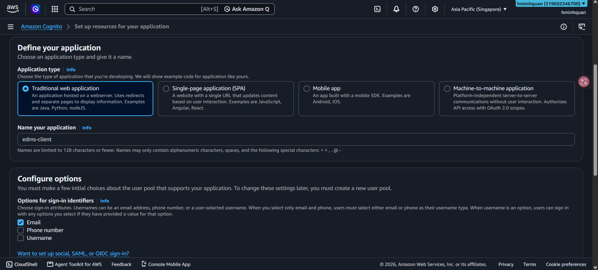
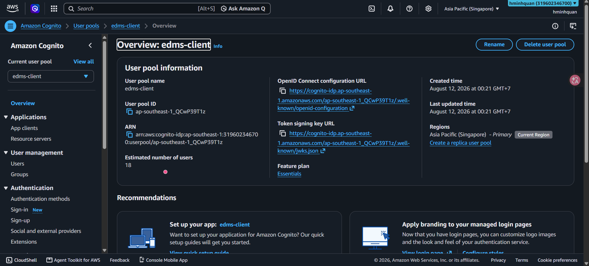
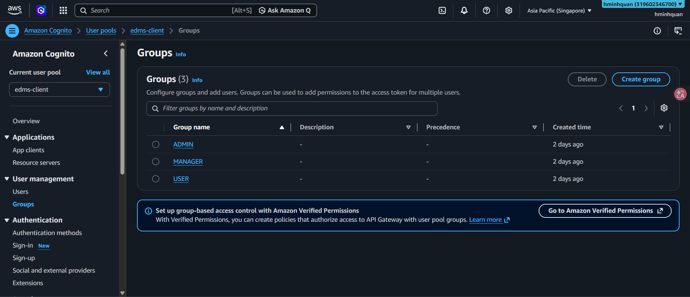

Amazon Cognito cung cấp xác thực và phân quyền theo vai trò cho EDMS. Người dùng đăng nhập và nhận **JWT** (JSON Web Token) mà backend xác thực trên mỗi request. Phần này tạo **User Pool**, **app client** không có secret, và ba nhóm tương ứng với các vai trò ứng dụng.

### 5.3.4.1 Mở Cognito console

1. Trong AWS console, đảm bảo region là **ap-southeast-1**.
2. Mở **Amazon Cognito console** → **User pools**.

### 5.3.4.2 Tạo User Pool

1. Bấm **Create user pool**.


2. Trong trang **Set up resources for your application**, cấu hình:

**Define your application**
+ **Application type:** chọn **Single-page application (SPA)** — EDMS là một React SPA. (Có các lựa chọn Traditional web app, Mobile, Machine-to-machine.)
+ **Name your application:** `edms-client`.

**Configure options**

*Options for sign-in identifiers*
+ Chọn **Email** làm sign-in identifier (người dùng đăng nhập bằng email và mật khẩu).

*Self-registration*
+ **Enable self-registration:** để **tắt** nếu bạn chỉ muốn admin tạo tài khoản (khuyến nghị cho công cụ doanh nghiệp nội bộ). Nếu muốn mở đăng ký công khai thì bật lên.
+ **Required attributes for sign-up:** nếu bật self-registration, chọn **Email** làm thuộc tính bắt buộc.

*Add a return URL (tùy chọn)*
+ **Return URL:** để phát triển local bạn có thể nhập `http://localhost:3000`. Trong production, đặt URL **Amplify** của bạn (ví dụ `https://main.d3xxxx.amplifyapp.com`). Cognito sẽ redirect về đây sau khi đăng nhập thành công.

3. Bấm **Create user directory**.



> **Ghi chú:** Với luồng console mới của Cognito, user pool và app client được tạo cùng nhau. **App client không có secret** để dùng được trong các luồng chạy trên trình duyệt (SPA).

### 5.3.4.3 Tạo các nhóm (vai trò)

Các Cognito group ánh xạ trực tiếp tới vai trò ứng dụng (`ADMIN` / `MANAGER` / `USER`).

1. Mở User Pool của bạn (`edms-user-pool`).
2. Mở tab **Groups**.
3. Bấm **Create group** và tạo ba nhóm:
+ `ADMIN`
+ `MANAGER`
+ `USER`



4. Gán người dùng vào các nhóm. Người dùng trong một nhóm kế thừa vai trò của nhóm đó trong ứng dụng.

> **Ghi chú:** `ADMIN` có toàn quyền, `MANAGER` quản lý tài liệu của nhóm mình, còn `USER` là thành viên thường với quyền xem/bình luận.

### 5.3.4.4 Ghi lại các ID

Backend và frontend cần các giá trị sau — hãy ghi lại:

```
COGNITO_USER_POOL_ID=<pool-id>     ví dụ ap-southeast-1_XXXXX
COGNITO_CLIENT_ID=<client-id>
COGNITO_REGION=ap-southeast-1
```

> **Ghi chú:** Backend ánh xạ một Cognito group thành vai trò ứng dụng (`ADMIN` / `MANAGER` / `USER`) và xác thực JWT trên mỗi request. Giữ pool ID và client ID để dùng trong cấu hình `.env` / SAM ở các phần sau.
